# 智忆助理 (MemoryMate) - 系统图表集合

> 本文件包含所有系统设计的Mermaid图表代码，可在支持Mermaid的编辑器或网页中渲染

---

## 1. 系统总体架构图

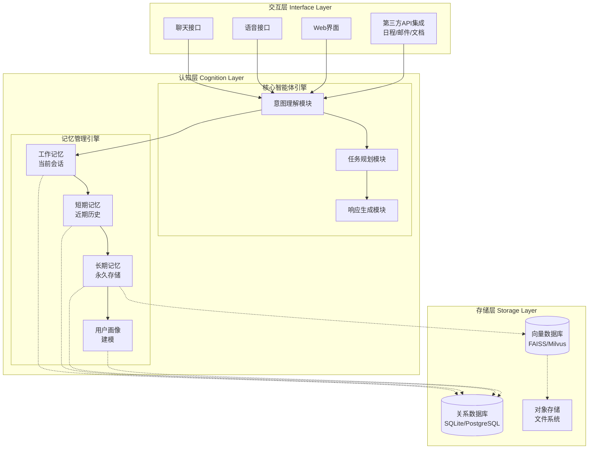

---

## 2. 数据流向图

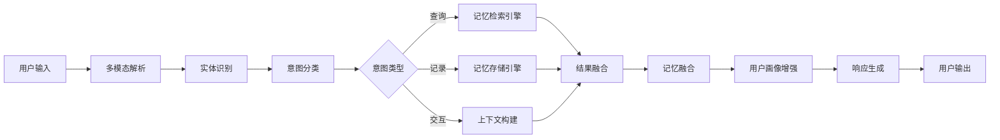

---

## 3. 记忆存储流程活动图

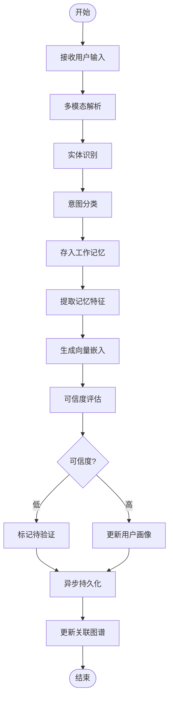

---

## 4. 记忆检索流程活动图

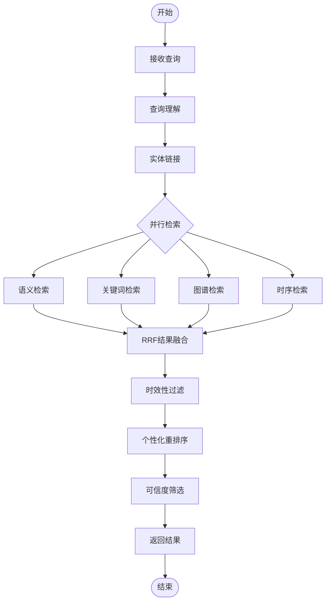

---

## 5. 三级记忆架构图

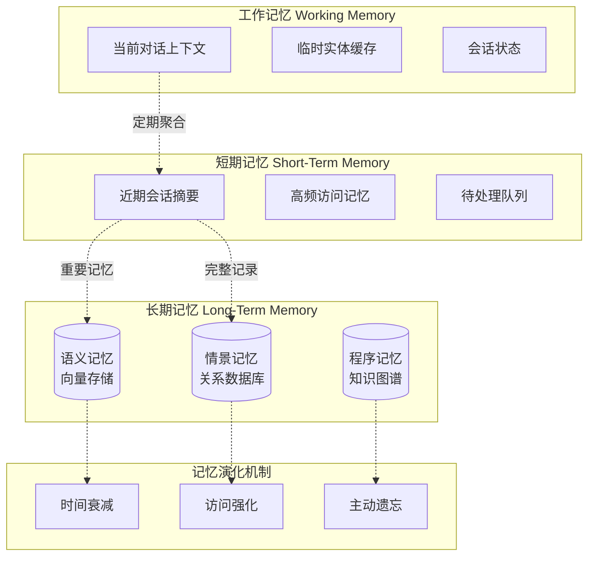

---

## 6. 混合检索架构图

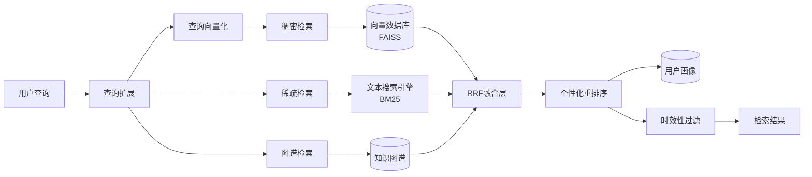

---

## 7. 用户画像模型图

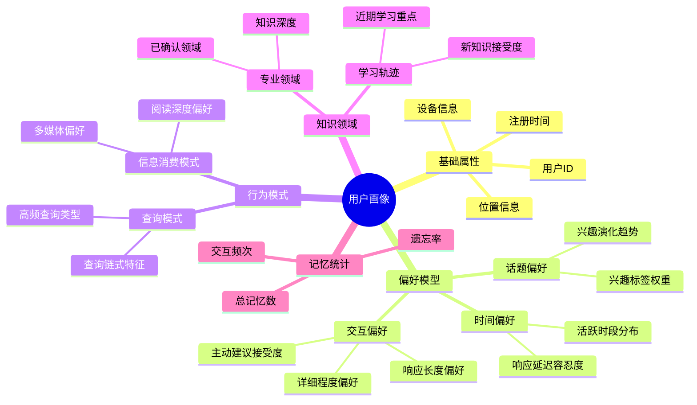

---

## 8. 记忆演化状态机

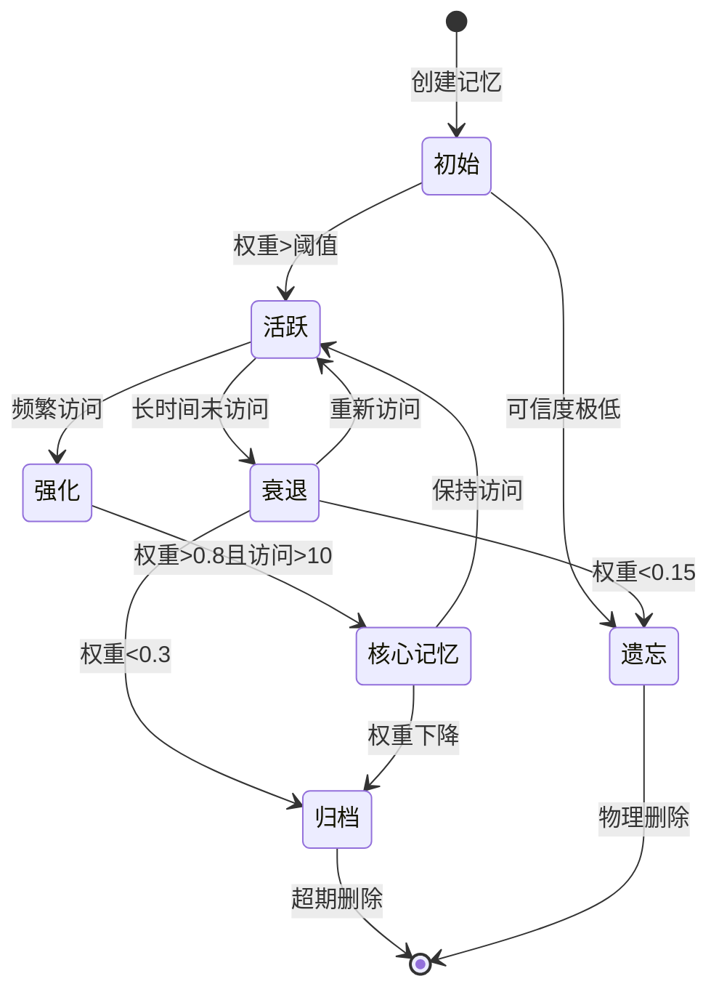

---

## 9. 用户画像学习流程图

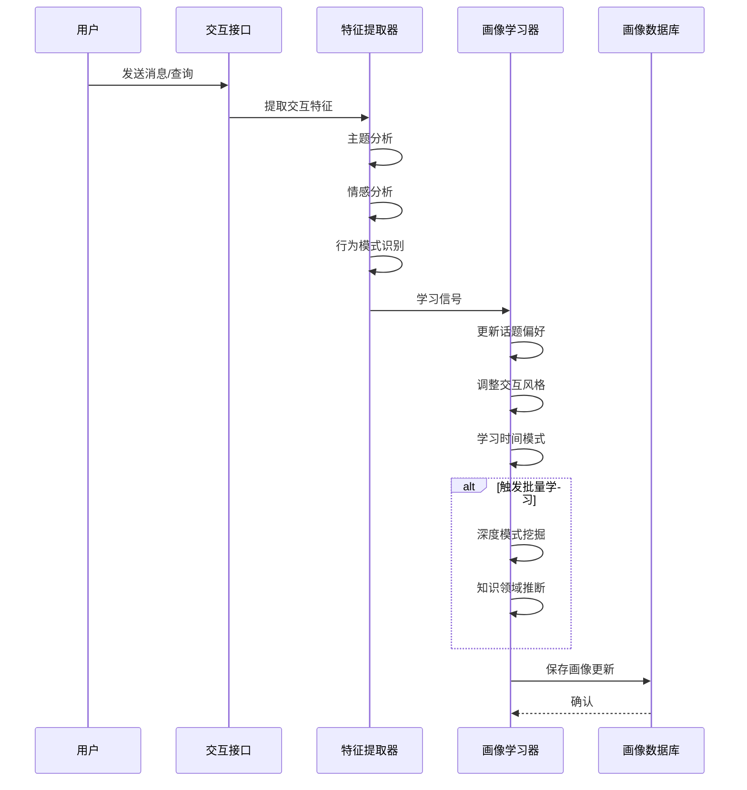

---

## 10. 个性化检索流程时序图

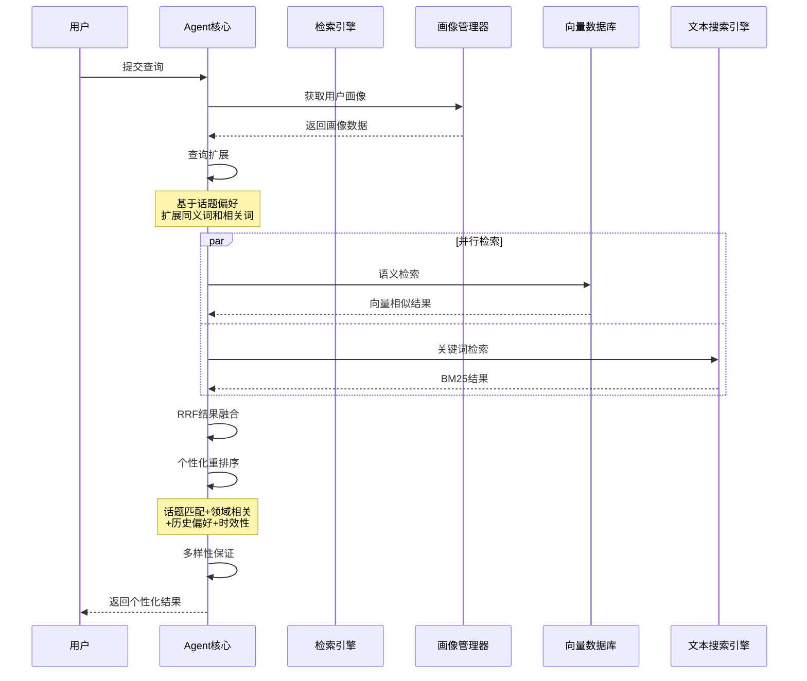

---

## 11. 模块依赖关系图

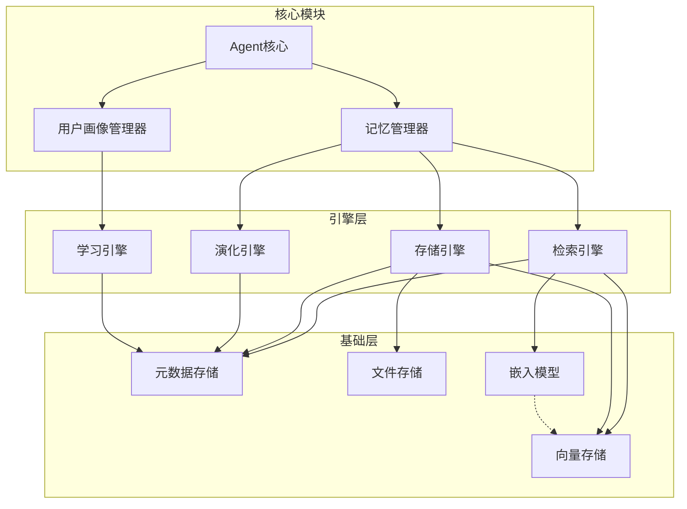

---

## 12. 系统部署架构图

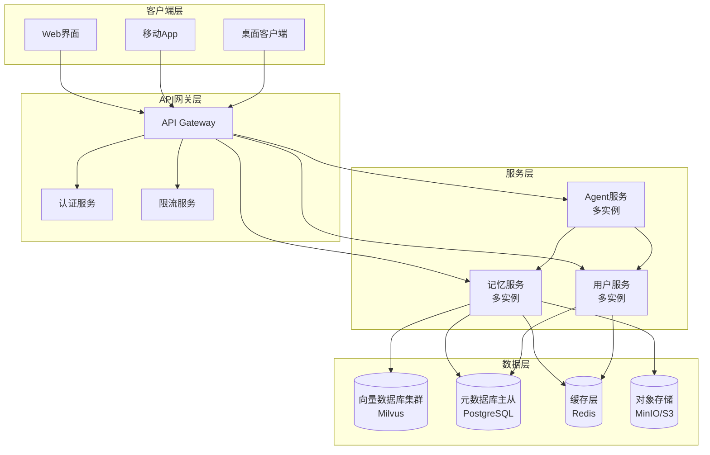

---

## 如何使用这些图表

### 方法1: VS Code + 插件
1. 安装 "Markdown Preview Mermaid Support" 或 "Mermaid Preview" 插件
2. 打开本文件即可预览图表

### 方法2: Mermaid Live Editor
1. 访问 https://mermaid.live/
2. 复制对应的Mermaid代码
3. 粘贴到编辑器中实时渲染

### 方法3: 导出为图片
在Mermaid Live Editor中点击 "Actions" -> "PNG/SVG" 导出

### 方法4: Markdown渲染器
许多现代Markdown渲染器支持Mermaid，如：
- GitHub/GitLab (原生支持)
- Notion (通过代码块)
- Typora
- Obsidian + 插件

---

*本文档配合《智忆助理详细设计文档》使用，提供可视化的系统架构参考。*
